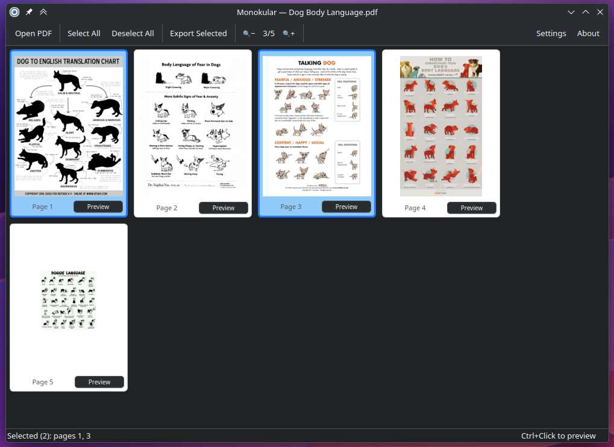
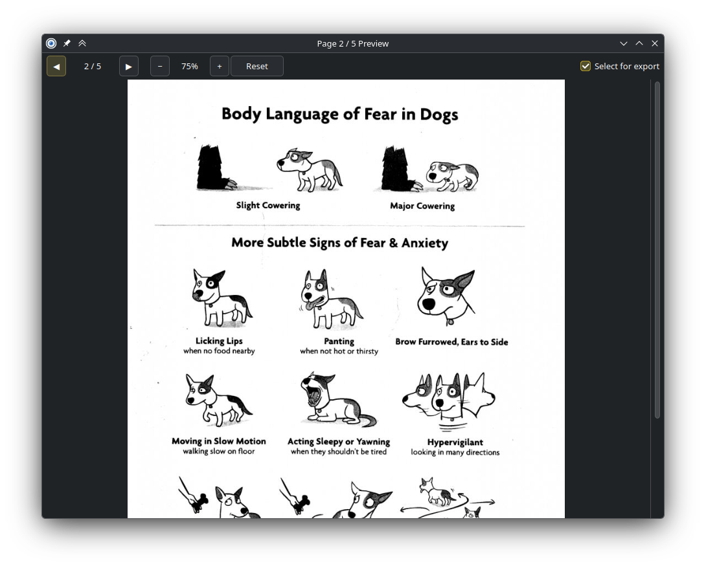
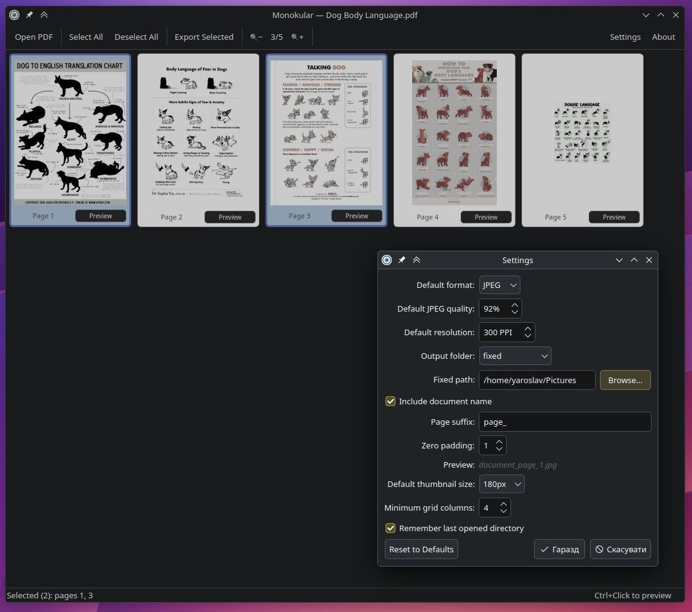

# Monokular

Monokular — because it does one thing and does it well: export PDF pages as images with a preview option.

## Contents

- [Screenshots](#screenshots)
- [Features](#features)
- [Keyboard Shortcuts](#keyboard-shortcuts)
- [Usage (local)](#usage-local)
- [Build a standalone binary (PyInstaller)](#build-a-standalone-binary-pyinstaller)
- [Install on Arch Linux (AUR)](#install-on-arch-linux-aur)
- [Build from source (PKGBUILD)](#build-from-source-pkgbuild)
- [Linux desktop integration (manual)](#linux-desktop-integration-manual)
- [Requirements](#requirements)

## Screenshots

Select pages from a thumbnail grid and export them as images.



Zoom into any page with a full-size preview.



Configure export format, quality, PPI, naming, and more.



## Features

- Open PDF files via toolbar, drag & drop, or command line
- Selectable page thumbnails in a responsive grid
- Preview pages with zoom (Ctrl+Click or Preview button)
- Rotate pages in the preview or straight from the toolbar — the grid, the
  preview, and the exported file all follow
- Export selected pages as PNG, JPEG, WEBP or TIFF, or collect them into a
  single PDF
- Configurable quality and PPI (72–1200)
- Jump back to the top of a long document with the floating button or `Home`
- Remembers main and preview window sizes between sessions
- Available in 25 languages, following your system locale

## Keyboard Shortcuts

- `Ctrl+Q` — Quit
- `Ctrl+Click` — Preview a page
- `Home` / `End` — Jump to the top or bottom of the thumbnail grid

In the preview window:

- `←` / `→` — Previous / next page
- `[` / `]` — Rotate the page left / right
- `Ctrl+Wheel` — Zoom

## Usage (local)

```bash
pip install -r requirements.txt
python main.py
```

Open a PDF from the command line:

```bash
python main.py /path/to/file.pdf
```

## Running the tests

```bash
pip install -r requirements-dev.txt
python -m pytest
```

## Build a standalone binary (PyInstaller)

```bash
pip install pyinstaller
pyinstaller monokular.spec
```

The binary will be at `dist/monokular`.

## Install on Arch Linux (AUR)

```bash
yay -S monokular
```

Or manually:

```bash
git clone https://aur.archlinux.org/monokular.git
cd monokular
makepkg -si
```

## Build from source (PKGBUILD)

1. Create a source tarball:

```bash
tar czf monokular-1.0.0.tar.gz --transform='s,^,monokular-1.0.0/,' \
    main.py requirements.txt monokular.desktop PKGBUILD \
    assets/icon.svg app/*.py translations/*.qm
```

2. Build and install:

```bash
makepkg -si
```

After installation, the following files are placed automatically:

- `/usr/bin/monokular` — launcher script
- `/usr/lib/monokular/` — app files
- `/usr/share/applications/monokular.desktop` — desktop entry
- `/usr/share/icons/hicolor/scalable/apps/monokular.svg` — app icon

3. Run:

```bash
monokular
```

## Linux desktop integration (manual)

For local (non-packaged) use, copy the desktop file:

```bash
cp monokular.desktop ~/.local/share/applications/
```

Edit `Exec` and `Icon` paths in the desktop file to point to your local install.

## Translations

Monokular follows your system locale and ships 25 languages: Bulgarian,
Catalan, Croatian, Czech, Danish, Dutch, Estonian, Finnish, French, German,
Greek, Hungarian, Italian, Latvian, Lithuanian, Norwegian Bokmål, Polish,
Portuguese, Romanian, Serbian, Slovak, Slovenian, Spanish, Swedish and
Ukrainian. If no catalogue matches your locale the interface stays in English.

To add or correct a language, see [translations/TRANSLATING.md](translations/TRANSLATING.md).

## Requirements

- Python 3.10+
- PyQt6
- PyMuPDF

WEBP and TIFF export needs Qt's extra image-format plugins (`qt6-imageformats`
on Arch). Without them Monokular simply leaves those two entries out of the
format list; PNG, JPEG and PDF always work.
